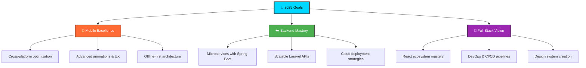

# <div align="center">👋 Hey there! I'm **Anuj**</div>

<div align="center">
  
[](https://readme-typing-svg.demolab.com)

</div>

<p align="center">
  
  
</p>

---

## 🎯 **About Me**

```dart
class Developer {
  final String name = "Anuj Bhalerao";
  final String location = "Indore, India 🇮🇳";
  final List<String> passions = [
    "Building blazing-fast mobile apps ⚡",
    "Performance optimization wizardry 🧙‍♂️",
    "Clean architecture evangelism 🏛️",
    "Exploring new tech frontiers 🔭"
  ];
  
  void currentFocus() {
    print("🔥 Crafting exceptional user experiences with Flutter");
    print("🚀 Scaling apps with Firebase & GetX");
    print("📱 Expanding horizons with React & Laravel");
  }
}
```

---

## 🛠️ **Tech Arsenal**

<div align="center">

### **Mobile Development**


### **Backend & Database**


### **Frontend & Tools**


</div>

---

## 🚀 **Featured Projects**

<div align="center">

| 🍕 **Food Delivery Ecosystem** | 🎥 **Reels Platform** | 🚛 **Fleet Management** |
|:---:|:---:|:---:|
| Full-stack Zomato clone with real-time tracking | TikTok-style app with 60 FPS performance | Enterprise fleet tracking & management |
| `Firebase` `GetX` `Real-time` | `Video Caching` `Optimization` | `Spring Boot` `Java` `REST APIs` |

| 🎓 **School Management System** | 🏎️ **Racing Game** | 🎲 **Satta Matka Platform** |
|:---:|:---:|:---:|
| Complete education platform (Mobile + Web) | Arcade racing with Flame engine | Secure betting platform with wallet |
| `Laravel` `Flutter` `Admin Panel` | `Game Dev` `Progression System` | `Transactions` `Real-time Updates` |

</div>

---

## 📊 **GitHub Analytics**

<div align="center">
  


</div>

---

## 🎯 **Current Objectives & Roadmap**

<div align="center">



</div>

### 🚀 **Active Development Focus**
- 🔧 **Perfecting upload pipelines** with smart compression & real-time progress
- 🔐 **Advanced security implementations** in Firestore rules & payment gateways
- 📊 **Analytics integration** for user behavior insights across platforms
- 🎨 **Design-to-code mastery** with Figma + automated component generation

### 🌟 **Learning & Growth**
- ⚡ **React ecosystem deep-dive** for modern web applications
- 🏗️ **Microservices architecture** patterns with Spring Boot
- 🚀 **DevOps automation** with GitHub Actions & Docker
- 📱 **Advanced Flutter** features (isolates, platform channels, custom renderers)

---

## 🌐 **Let's Connect**

<div align="center">

[](mailto:anujbhalerao3@gmail.com)
[](https://linkedin.com/in/anuj-bhalerao-8b8a951ba)
[](https://github.com/DaMsXerX)
[](https://your-portfolio.com)

</div>

---

<div align="center">

### 💡 *"Performance isn't just a feature — it's the foundation of great user experiences."*

**⭐ Star my repositories if you find them helpful!**

</div>
